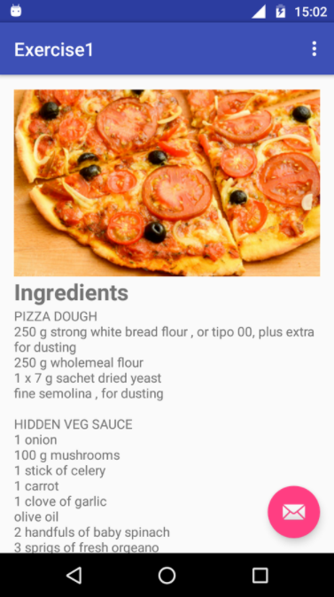

# Android-Workshop-Highschool
Introduction to programming and basics of developing in Android platform workshops for highschool students.

## Workshops 
Android Workshops for highschool students. The first part of the lessons are about basics of programming, agile work methodologies, programming tools and User Experience. The second part of workshops are about basics of Android programming. The purpose of the workshops were to provide basic programming and development knowledge to start developing on Android platform. Workshops included HTML [presentation](presentation) and Android app [exercises](exercises).

### Lessons
In the [first lesson](exercises/Exercise1), create a screen showing the recipe of favorite dish (ViewGroups, Views, resources). In the [second lesson](exercises/Exercise2), create an application that allows to go through the login process (Activity, Intent, Views). In the [third lesson](exercises/Exercise3), create an application for checking the location and taking and displaying the photo (Intent, LocationManager, Permissions, View). In the [fourth lesson](exercises/Exercise4), create a list of elements with the interaction of choice (ListView, Adapter, Toast).

### Screenshots
Screenshots shows screens of the finished lessons.

    
